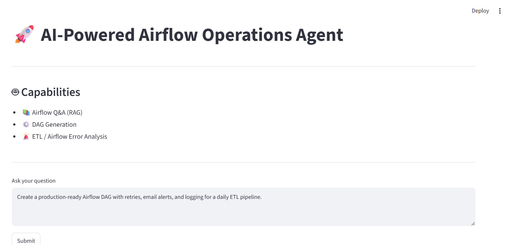
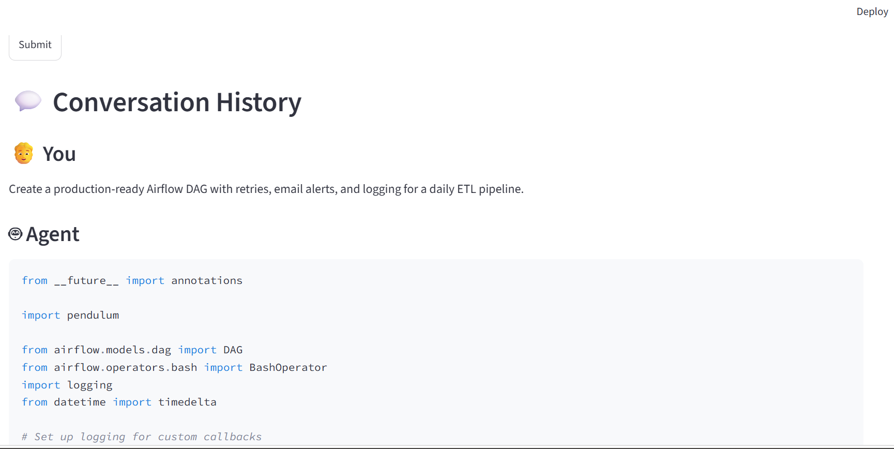
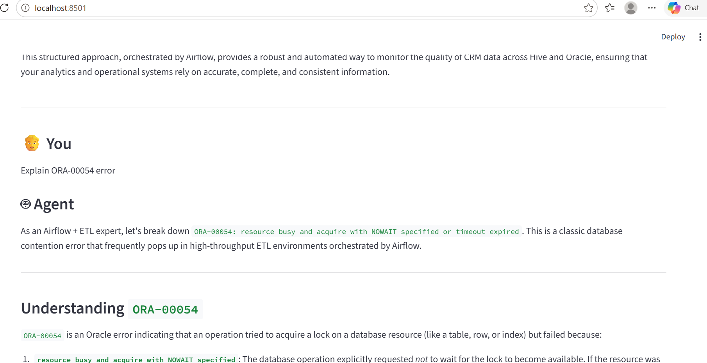

# 🚀 Multi-Agent Airflow AI Assistant

## 🔥 What it does

This AI-powered assistant helps data engineers by:

- Answering Apache Airflow questions using RAG (ChromaDB)
- Generating Airflow DAGs using Google Gemini
- Analyzing Airflow and ETL errors
- Routing requests through an intelligent agent system
- Providing quick operational assistance for data pipelines

---

## 🧠 Architecture

User → Streamlit UI → Agent Router → {RAG Search / DAG Generator / Error Analyzer} → Gemini LLM → Response

---

## ⚙️ Tech Stack

- Python
- Streamlit
- Google Gemini API
- ChromaDB
- Sentence Transformers
- Apache Airflow

---

## 🚀 Features

- Multi-agent routing system
- DAG code generation
- Retrieval-Augmented Generation (RAG)
- Airflow & ETL error analysis
- Conversation history
- ChromaDB document retrieval
- Gemini-powered responses

---

## 🧠 How It Works

1. User submits a query through the Streamlit interface.
2. The Agent Router analyzes the request.
3. DAG-related queries are sent to the DAG Generator.
4. Error-related queries are sent to the Error Analyzer.
5. General Airflow questions use RAG with ChromaDB.
6. Gemini generates the final response.
7. The answer is displayed in the Streamlit UI.

---

## 📸 Demo Screenshots

### Main UI


### DAG Generation


### Error Analysis


---

## ▶️ Run the Project

```bash
pip install -r requirements.txt
streamlit run app.py
```

---

## 📌 Use Cases

- Airflow DAG generation
- ETL troubleshooting
- Airflow learning assistant
- Data engineering productivity tool
- Pipeline operations support

---

## 🔮 Future Enhancements

- SQL validation tool
- Airflow log ingestion
- Multi-document RAG
- Long-term memory
- Advanced agent orchestration
- Deployment on Streamlit Cloud

---

## 📄 Project Summary

AI-powered Airflow Operations Assistant that generates DAGs, analyzes ETL errors, and answers Apache Airflow questions using ChromaDB, Sentence Transformers, Google Gemini, and Streamlit.
