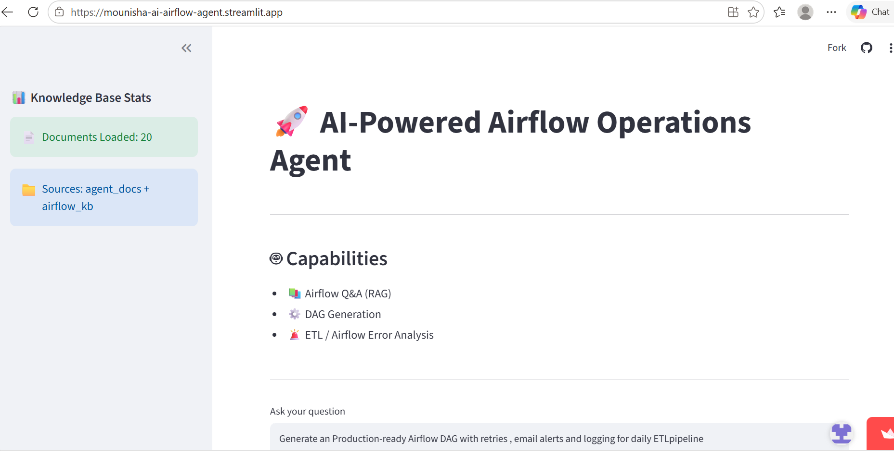
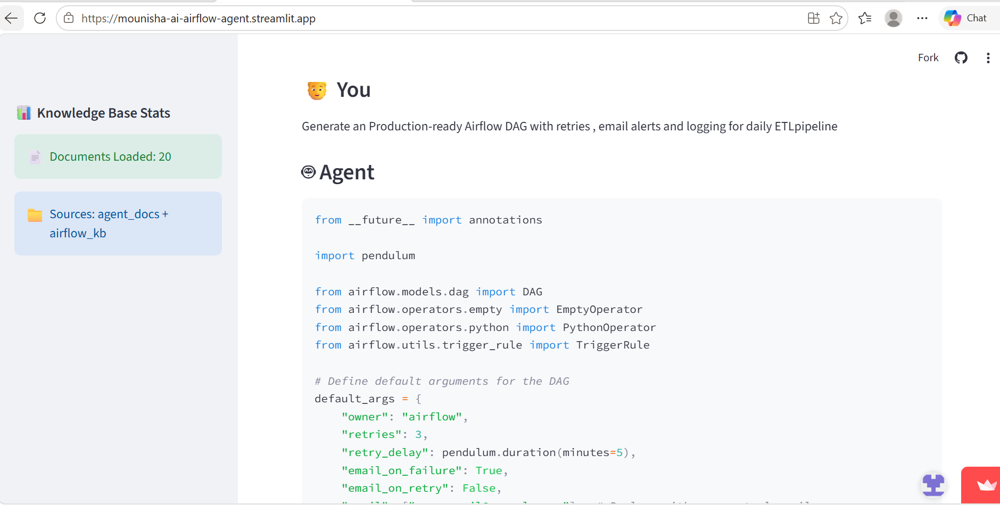
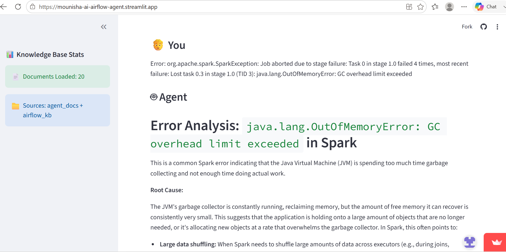

# 🚀 Multi-Agent Airflow AI Assistant

## 🔥 What it does

This AI-powered assistant helps data engineers by:

- Answering Apache Airflow questions using Retrieval-Augmented Generation (RAG), grounded in a curated knowledge base
- Generating production-ready Airflow DAGs using Google Gemini
- Analyzing Airflow, PySpark, and Hive errors
- Routing each request through an intelligent agent router based on intent
- Providing quick, self-contained operational assistance for data pipelines — no external Airflow instance required

---

## 🌐 Live Demo

Streamlit App:
https://mounisha-ai-airflow-agent.streamlit.app/

---

## 🧠 Architecture

```
User → Streamlit UI → Agent Router (intent classification)
                          │
        ┌─────────────────┼─────────────────┐
        ▼                 ▼                 ▼
   RAG Search        DAG Generator      Error Analyzer
 (embed query →            │                  │
  ChromaDB search)         │                  │
        │                  │                  │
        └─────────────────▶│◀─────────────────┘
                            ▼
                  Gemini 2.5 Flash-Lite
                            │
                            ▼
                         Response
```
The Agent Router inspects each question for keywords related to DAG generation or error handling. DAG Generator and Error Analyzer send the question straight to Gemini with a tailored prompt. RAG Search additionally embeds the question with Sentence Transformers, retrieves the most relevant documents from ChromaDB, and passes that context to Gemini before generating a grounded answer.

---

## ⚙️ Tech Stack

- Python
- Streamlit
- Google Gemini API (gemini-2.5-flash-lite)
- ChromaDB (persistent vector store)
- Sentence Transformers (all-MiniLM-L6-v2)
- Apache Airflow domain knowledge


---

## 📚 Knowledge Base

The agent ships with a pre-built knowledge base, split into two parts:

- **`airflow_kb/`** — core Airflow concepts (DAGs, operators, sensors, executors, scheduling, XComs, hooks/connections, trigger rules, TaskGroups, architecture, pools/priority) plus dedicated common-error references for **Airflow, PySpark, and Hive**.
- **`agent_docs/`** — the agent's own self-knowledge: its architecture, each tool's behavior, the tech stack, and how intent routing works. This lets the agent accurately answer meta-questions like *"what model do you use?"* or *"how does your error analyzer work?"* instead of guessing.

On first run, if the ChromaDB collection is empty, the app automatically embeds and ingests every `.md` file in both folders — no manual setup step required after deployment. A standalone `ingest.py` script is also included for local/manual re-ingestion if needed.

---

## 🚀 Features

- Intent-based agent routing across three specialized tools
- DAG code generation with retries, logging, and email alerts baked in
- Retrieval-Augmented Generation (RAG) backed by a real, curated knowledge base
- Airflow, PySpark, and Hive error analysis (cause-and-fix or full root-cause breakdown)
- Self-bootstrapping knowledge base — auto-ingests on first run, even on a fresh deploy
- Agent self-awareness for questions about its own architecture and tools
- Conversation history within a session
- Graceful fallback handling if Gemini returns an empty response or ChromaDB retrieval fails

---

## 🧠 How It Works

1. User submits a query through the Streamlit interface.
2. The Agent Router checks the query for DAG-generation or error-related keywords.
3. DAG-related queries are sent to the DAG Generator, which prompts Gemini to produce a production-ready DAG.
4. Error-related queries are sent to the Error Analyzer, which prompts Gemini with troubleshooting instructions.
5. All other queries go to RAG Search: the question is embedded, ChromaDB returns the most relevant knowledge base documents, and that context is passed to Gemini alongside the question.
6. Gemini generates the final response.
7. The answer is displayed in the Streamlit UI and added to the session's conversation history.


---

## 📸 Demo Screenshots

### Main UI


### DAG Generation


### Error Analysis


---

## ▶️ Run the Project

```
pip install -r requirements.txt
streamlit run app.py
```

The knowledge base will auto-ingest into ChromaDB the first time the app runs, as long as the `agent_docs/` and `airflow_kb/` folders are present alongside `app.py`.

To re-ingest manually at any time:

```
python ingest.py
```

---

## 📌 Use Cases

- Airflow DAG generation
- ETL troubleshooting (Airflow, PySpark, Hive)
- Airflow learning assistant
- Data engineering productivity tool
- Pipeline operations support

---

## 🔮 Future Enhancements

- SQL validation tool
- Live Airflow log ingestion
- Expanding the knowledge base with real-world incident postmortems
- Long-term memory across sessions
- True multi-agent orchestration with specialized tool-using sub-agents
- Feedback loop to flag and improve low-quality RAG retrievals

---

## 📄 Project Summary

AI-powered Airflow Operations Assistant that generates DAGs, analyzes Airflow/PySpark/Hive errors, and answers Apache Airflow questions using a self-bootstrapping RAG pipeline built on ChromaDB, Sentence Transformers, Google Gemini, and Streamlit.
